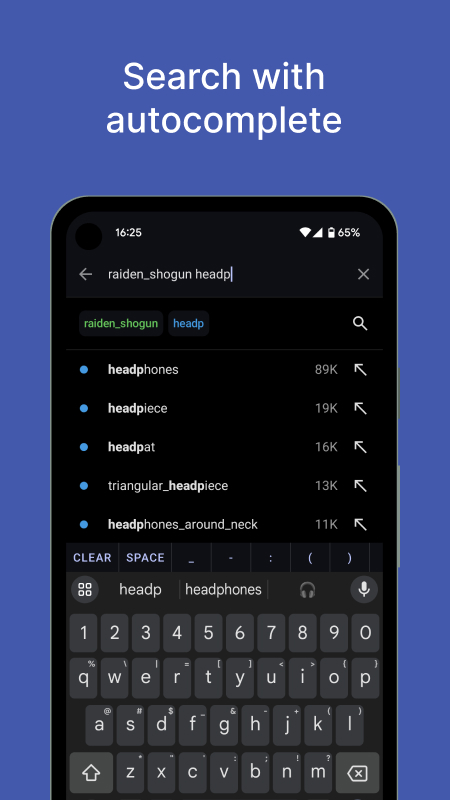

# 🍊 Mikansei

**Mikansei 未完成** _(lit. unfinished)_ is a [Danbooru](https://safebooru.donmai.us/posts) client for Android. Made with Jetpack Compose 🚀.

**Danbooru** is an image board website for anime-style artworks with tagging system that makes organizing easier. You can easily browse your favorite characters or real artists here.

## Screenshots

  
  
  

  
  
  

> _Note: the screenshots don't indicate the final product._

## Features

- Sync and switch multiple Danbooru accounts with ease
- System-based theme with dynamic colors support and 3 themes available (light, dark & black)
- Optimized for one-handed operation
- Image viewer with zoom, pan & gestures support
- Video player with controls & gestures support
- Download and share posts
- DNS over HTTPS enabled by default
- Using the latest Android tech stacks

**Features that are currently supported and synced with Danbooru**

- View, favorite and vote posts
- Searching with autocomplete
- Favorites and favorite groups
- Saved searches
- Tags filtering/blacklisting
- Safe mode toggle
- Show deleted posts toggle
- Image detail size switch
- Account deactivation

## Download

- Version: **1.0.2** (102)
- Updated at: 2024-09-15
- Min. Android version: Android 5.0 Lollipop (API level 21)
- Download: [APK](https://github.com/uragiristereo/Mikansei/releases/download/102-1.0.2/Mikansei_v1.0.2_102-oss.apk)
- Changelogs: [here](https://github.com/uragiristereo/Mikansei/releases/tag/102-1.0.2)

## Tech Stacks

- Language: [Kotlin](https://kotlinlang.org)
- User Interface: [Jetpack Compose](https://developer.android.com/jetpack/compose)
- Concurrency: [Coroutines](https://kotlinlang.org/docs/coroutines-overview.html) & [Flow](https://kotlinlang.org/docs/flow.html)
- Dependency Injection: [Koin](https://insert-koin.io)
- Local Database: [Room](https://developer.android.com/training/data-storage/room)
- Networking: [OkHttp](https://square.github.io/okhttp) & [Retrofit](https://square.github.io/retrofit)
- Image Loading: [Coil](https://coil-kt.github.io)
- Video Loading: [Media3](https://developer.android.com/media/media3)

## Resources Used

- API: [Danbooru API](https://danbooru.donmai.us/wiki_pages/help:api)
- Design Specs: [Figma](https://www.figma.com/file/R0d905PNBuPabrtoXwYxoC/Mikansei?t=jIm0pHq82qmC7S5z-1)
- Design System: [Noctiluca](https://github.com/uragiristereo/noctiluca)
- Icons: [Material Symbols](https://fonts.google.com/icons)

## Building

To build this project, you need the latest stable of [Android Studio](https://developer.android.com/studio).

1. Clone the project and open in Android Studio.
2. Sync project with Gradle then Run `app`.

**Notes:**

By default it will use the `ossDebug` build variant. The `playRelease` build variant will bundle Firebase Crashlytics to the app. The rest of the build variants won't bundle Firebase at all.

To use the `playRelease` build variant, first you need to create a Firebase Android app with `com.uragiristereo.mikansei` as the package name then store the `google-services.json` file in the root of `app` module.

## License

    Copyright 2024 Agung Watanabe

    Licensed under the Apache License, Version 2.0 (the "License");
    you may not use this file except in compliance with the License.
    You may obtain a copy of the License at

       http://www.apache.org/licenses/LICENSE-2.0

    Unless required by applicable law or agreed to in writing, software
    distributed under the License is distributed on an "AS IS" BASIS,
    WITHOUT WARRANTIES OR CONDITIONS OF ANY KIND, either express or implied.
    See the License for the specific language governing permissions and
    limitations under the License.
